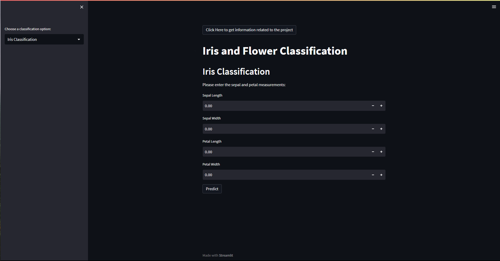
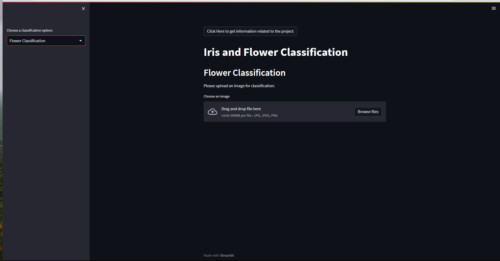

# Iris and Flower Classification Web App

## Overview

This web application leverages deep learning to classify IRIS flowers and general flower images. It serves botany, horticulture, and conservation needs by automating flower identification.

## Features

### Iris Classification

- Input petal and sepal dimensions.
- Output iris species and description.

### Flower Classification

- Upload a flower image.
- Output the predicted flower category and related description.

## User Interface

- Title/Header: "Flower and Iris Classification".
- Selection Buttons: Choose between "Iris Classification" and "Flower Classification".
- Input Fields: Enter parameters for iris classification.
- Image Upload Field: Upload an image for flower classification.
- Output Fields: Display results including name, description, or category.

## Deep Learning Models

1. Iris Classification: Pre-trained model for iris classification.
2. Flower Classification: Pre-trained model for general flower image classification.

## Prototype Evaluation

- **Iris Classification Model**: Achieves 90% accuracy on iris dataset.
- **Flower Classification Model**: Achieves 80% accuracy on general flower dataset.

## Installation

- Clone the repository.
- Install required dependencies from `requirements.txt`.

## Usage

- Run the application using `streamlit run app.py`.
- Access the web interface at `http://localhost:5000`.
- Classify iris flowers or upload flower images.

## Contributing

- Fork the repository.
- Create a new branch for your contribution.
- Make changes and test them thoroughly.
- Create a pull request to merge your changes.

## License

This project is licensed under the MIT License.

## Contact

For questions or inquiries, contact us at [azafridi9547@email.com](mailto:azafridi9547@email.com).
